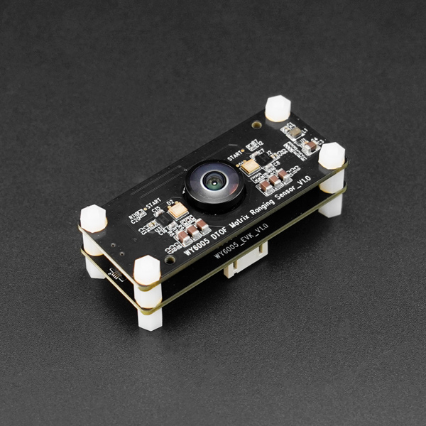

# DFRobot_64x8DTOF
- [中文版](./README_CN.md)

## Overview
The DFRobot_64x8DTOF is a high-precision DToF (Time of Flight) sensor module that provides accurate distance measurements in a compact form factor. It features serial communication interface, multiple operating modes, and high-resolution distance data, making it suitable for applications in robotics, automation,proximity sensing.

The sensor includes built-in signal processing capabilities and supports various output modes to meet different application requirements. Each 64x8DTOF sensor is factory calibrated and can be easily integrated into your project via the serial interface.

## Product Link  (https://www.dfrobot.com/)

```text
SKU: SEN0682
```

## Table of Contents
* [Summary](#summary)
* [Installation](#installation)
* [Methods](#methods)
* [Compatibility](#compatibility)
* [History](#history)
* [Credits](#credits)

## Summary
This library provides a way to drive the 64x8DTOF ToF sensor under the Arduino IDE. It allows you to configure the sensor, read distance data, and perform various operations to suit your application needs.

## Installation
### Arduino Library Installation
1. Download the library file from the GitHub repository.
2. Paste it into the Arduino libraries directory.
3. Open the examples folder and run the demo sketch to test the sensor.
4. Example Explanation
   - `getMultiPoint.ino`: Demonstrates reading the x, y, z coordinates and intensity values of multiple points.
   - `getSinglePoint.ino`: Demonstrates reading the x, y, z coordinates and intensity values of a single point.
   - `getSingleLine.ino`: Demonstrates reading the x, y, z coordinates and intensity values of a single line.

## Methods
### Arduino C++ Library


```C++
/**
 * @struct sPoint_t
 * @brief DFRobot 64x8DTOF sensor point data structure
 */
typedef struct {
    int16_t xBuf[DTOF64X8_MAX_POINTS]; /*!< X-axis coordinate buffer */
    int16_t yBuf[DTOF64X8_MAX_POINTS]; /*!< Y-axis coordinate buffer */
    int16_t zBuf[DTOF64X8_MAX_POINTS]; /*!< Z-axis coordinate buffer(Distance) */
    int16_t iBuf[DTOF64X8_MAX_POINTS]; /*!< Array storing intensity values. */
} sPoint_t;

/**
 * @fn DFRobot_64x8DTOF
 * @brief Constructor, passing in serial port and configuration
 * @param serial Hardware serial port reference
 * @param config Serial port configuration (e.g., SERIAL_8N1)
 * @param rxPin RX pin number (optional for platforms that support remapping)
 * @param txPin TX pin number (optional for platforms that support remapping)
 */
DFRobot_64x8DTOF(HardwareSerial &serial, uint32_t config, int8_t rxPin, int8_t txPin);

/**
 * @fn begin
 * @brief Initialize the sensor serial port and enable data stream
 * @param baudRate Serial communication baud rate (must be 921600)
 * @return bool True if initialization succeeded (serial started and stream enabled), false otherwise
 * @note ESP8266 and AVR platforms are not supported by this library's current implementation.
 */
bool begin(uint32_t baudRate = 921600);

/**
 * @fn getData
 * @brief Trigger one frame and read raw x/y/z values (no filtering)
 * @param timeoutMs Timeout in milliseconds to wait for a complete frame
 * @return Number of points parsed, or -1 on error/timeout
 */
int getData(uint32_t timeoutMs = 300);

/**
 * @fn configMeasureMode
 * @brief Configure measurement output mode — Full output (all points).
 * @return bool True if configuration succeeded and stream control restored,
 *              false on communication error or device rejection.
 */
bool configMeasureMode(void);

/**
 * @fn configMeasureMode
 * @brief Configure measurement output mode — Single line.
 * @param lineNum Line index to output (1..8).
 * @return bool True if configuration succeeded and stream control restored,
 *              false on communication error or invalid arguments.
 */
bool configMeasureMode(uint8_t lineNum);

/**
 * @fn configMeasureMode
 * @brief Configure measurement output mode — Single point.
 * @param lineNum Line index containing the point (1..8).
 * @param pointNum Point index within the line (0..64).
 * @return bool True if configuration succeeded and stream control restored,
 *              false on communication error or invalid arguments.
 */
bool configMeasureMode(uint8_t lineNum, uint8_t pointNum);

/**
 * @fn configMeasureMode
 * @brief Configure measurement output mode — Multi-point.
 * @param lineNum Line index (1..8)
 * @param startPoint Start point index within the line (1..64)
 * @param endPoint End point index within the line (1..64), must be >= startPoint
 * @return bool True if configuration succeeded and stream control restored,
 *              false on communication error or invalid arguments.
 */
bool configMeasureMode(uint8_t lineNum, uint8_t startPoint, uint8_t endPoint);

/**
 * @fn configFrameMode
 * @brief Configure whether sensor runs in single-frame or continuous frame mode
 * @param mode Frame mode (eFrameSingle or eFrameContinuous)
 * @return bool type, indicates the configuration status
 * @retval true Configuration successful
 * @retval false Configuration failed
 */
bool configFrameMode(eFrameMode_t mode);
```

<!-- Raspberry Pi Python usage removed as requested -->

**Note:** Continuous frame mode is not implemented yet; do not use it.

**Note:** The sensor currently only supports baud rate 921600; other baud rates are not supported.


## Compatibility
| Platform | Work Well | Work Wrong | Untested | Remarks |
|----------|-----------|------------|----------|---------|
| Arduino UNO |  |√| | |
| Arduino MEGA2560 |  | √|| |
| Arduino Leonardo |  | √|  | |
| FireBeeetle-M0 |  √| |  | |
| FireBeeetle2 -ESP32-E |  √| |  | |
| ESP8266 |  |√  | | |


## History
- 2026/01/26 - Version 1.0.0 released.
## Credits
Written by PLELES (feng.yang@dfrobot.com),2026.(Welcome to our [website](https://www.dfrobot.com/))
